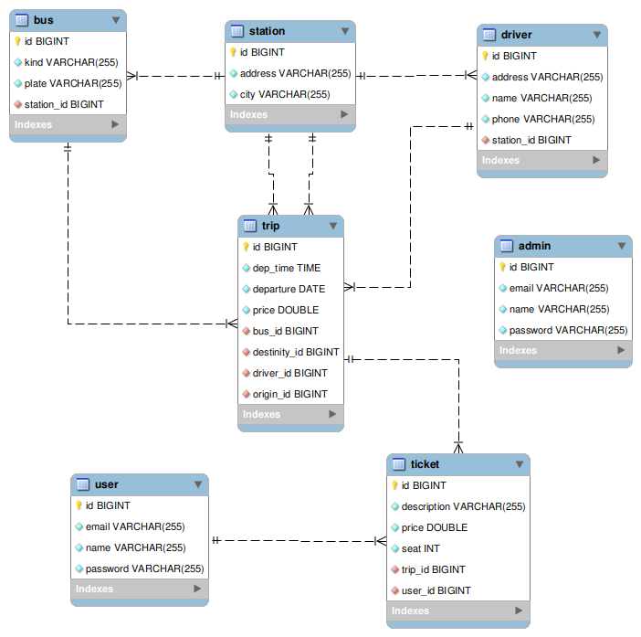

# tickets Spring Boot V2

Se desarrolla un Backend para venta de boletos de autobus utilizando Spring Boot Y las dependencias Spring Web, Spring JPA, Spring Rest Repositories, Spring Validation, Spring Security, MySQL Driver, Lombok y mapstruct.

### Especificaciones
Se tienen terminales en diferentes estados de la República, las cuales son origen y destino de los viajes. Cada terminal tiene adscritos un conjunto de autobuses y uno de conductores, los cuales son asignados a cada viaje según su disponibilidad y de manera independiente unos de otros. Los viajes son programados con origen, destino, fecha y hora de salida. El precio del boleto se establece al programar el viaje (dependiendo de diferentes factores). Todos los autobuses tienen cuarenta asientos y se clasifican en las clases primera, segunda y tercera; otras características importantes que se deben tomar en cuenta son la matrícula del autobús y su estado mecánico (operativo o en mantenimiento). Los clientes deben registrarse con: nombre completo, domicilio, correo electrónico y telefono. Cuando el cliente compra un vije selecciona un asiento. Para cada viaje de ida, hay uno de regreso con el mismo autobús y el mismo conductor. El usuario "administrador" tiene acceso y puede modificar todas las tablas (operaciones CRUD), los usuario "cliente" pueden leer "viajes", crear-leer-actualizar su propia información en "clientes" y crear-leer "boletos" (no puede hacer cancelaciones ni cambios).

### Compilación-Construcción-Ejecución
Para compilar y ejecutar en desarrollo:
~~~
mvn clean   //opcional
mvn spring-boot:run
~~~

Para compilar y construir un archivo jar:
~~~
mvn clean   //recomendado
mvn package
~~~

Para ejecutar el jar
~~~
java -jar ./target/tripsSpringBoot-0.0.1-SNAPSHOT.jar
~~~

Los siguientes end point son públicos:

GET
~~~
http://localhost:8080/trips
http://localhost:8080/trips/{id}
~~~

Como USER, se puede acceder a los siguientes end points:

GET
~~~
http://localhost:8080/tickets
http://localhost:8080/tickets/{id}
http://localhost:8080/trips
http://localhost:8080/trips/{id}
http://localhost:8080/users
http://localhost:8080/users/{id}
~~~

Como ADMIN, se puede acceder a los siguientes end points:

GET | POST | PUT | DELETE
~~~
http://localhost:8080/admins
http://localhost:8080/admins/{id}
http://localhost:8080/buses
http://localhost:8080/buses/{id}
http://localhost:8080/drivers
http://localhost:8080/drivers/{id}
http://localhost:8080/stations
http://localhost:8080/stations/{id}
http://localhost:8080/tickets
http://localhost:8080/tickets/{id}
http://localhost:8080/trips
http://localhost:8080/trips/{id}
http://localhost:8080/users
http://localhost:8080/users/{id}
~~~

